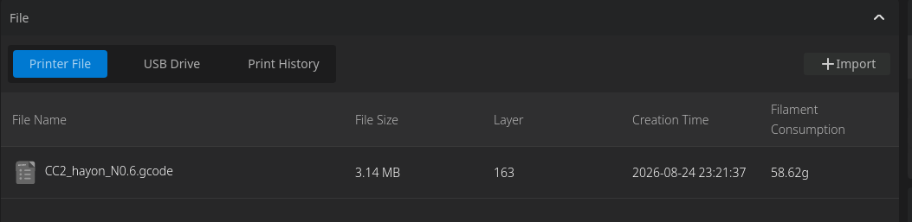
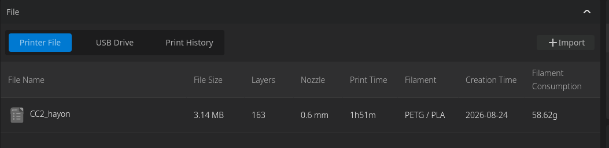

# ElegooSlicer-add

Unofficial ElegooSlicer add-ons, UI patches, compatibility fixes and experiments, organized by feature and slicer version.

Repository: https://github.com/MolgoVulgo/ElegooSlicer-add

This repository is intended to host small, isolated patches rather than a fork of ElegooSlicer. Each patch lives in its own directory and is validated against known target-file checksums before it can be installed.

## Repository layout

```text
ElegooSlicer-add/
├── README.md
├── REPOSITORY_DESCRIPTION.txt
├── install.sh
├── docs/
└── patches/
    └── cc2-file-list/
        ├── README.md
        ├── TECHNICAL.md
        ├── install.sh
        ├── metadata.env
        ├── sha256.env
        ├── detect.sh
        ├── patcher.py
        └── payload/
            ├── README.md
            ├── get-file-list.js
            ├── file-list-mapping.js
            ├── print-file-list-component.js
            └── file-list.css
```

## Current hacks

### CC2 file list

Enhances the Centauri Carbon 2 file list embedded in ElegooSlicer / ElegooLink. The current implementation targets **ElegooSlicer v1.5.3.4 on Linux**.

Before:



After:



See `patches/cc2-file-list/README.md`.

## Version policy

A patch is compatible only with the target-file checksums explicitly listed in its directory. Never assume that a patch written for one bundled file will work on another build.

Installers must verify the original file checksum before modifying anything. If the checksum does not match, the installer must stop instead of guessing, unless the user explicitly forces the attempt.

## Updates

ElegooSlicer updates, reinstalls or repairs may restore modified resources to their original state. A hack may therefore need to be applied again after an update. A newer ElegooSlicer version may also require a new patch implementation.

## Disclaimer

This project is unofficial and is not affiliated with, endorsed by, or supported by ELEGOO.

All modifications are provided without warranty. They alter internal ElegooSlicer resources and may stop working after an application update. Use them at your own risk. The author and contributors are not responsible for application failures, failed prints, data loss, hardware issues, or other direct or indirect consequences resulting from their use.
